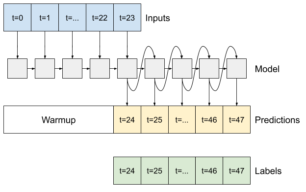

# Overall Architecture

We develop Stlearn library to encapsulate machine learning codes. We employ Object Oriented Design Patterns to design the framework. We use design patterns for this framework because:
* We should avoid add codes to existing classes to make them support more general information,
* Handle possible future changes in requirement in advance,
* Encapsulate as many codes as possible and only write codes when necessary.

To achieve this, we select Abstract Factory Pattern (Erich Gamma, 1994) as my design pattern for Stlearn framework. Below, we define system as a machine learning client system that is either faced with commercial user or faced with researcher that studies the performance of different machine learning models. We define product as required data and machine learning model. This pattern applies to our framework because:
* The system needs to be independent from the way the products are created, client only cares about what model to call and it is solely the developer's responsibility to implement and specify how products are created using specified protocol or API.
* The system should be configured to work with multiple families of products, where different machine learning task consist of pipelines with different dataset and models.
* A family of products is designed to work together, where one type machine learning task requires a specific type of data and models.

Based on general ideas of Abstract Factory Pattern, we design the framework and modules of Stlearn.


In this framework, the client system is expected to use `Data` and `Model` objects and all their derived classes objects as their products to perform machine learning task. The rule of abstract factory discourages the client to directly call constructor of these objects to access specific product objects, because clients are expected not to know anything about how to construct or implement a specific product, and because how to construct and implement a specific product may change from time to time. Instead, the client is expected to go to `StlearnFactory` and all its derived classes to access specific product through unified and constant APIs.

# Module: Factory

## Design

To make the process of stock selection as clear as possible and to avoid potential changes in client codes as much as possible, we use `Factory` classes to create all products for machine learning/deep learning tasks we need. Similar to what we do with `Model` classes, `Factory` class is further derived by `MlFactor` and `DlFactor` to implement different ways to create machine learning and deep learning tasks' data and models. We then implement concrete classes by deriving from these two super classes and override `_load()` function to define how to create relevant data and models that will be finally returned to client codes.

```python
class StlearnFactory(ABC):

    def __init__(self, train_start, val_start, test_start, test_end):
        self._train_start = train_start
        self._val_start = val_start
        self._test_start = test_start
        self._test_end = test_end
        self._load()
        pass

    def create_data(self):
        return self._data

    def create_model(self):
        return self._model

    @abstractmethod
    def _load(self):
        pass
```

## Demo and Application

To extend the library and build your own factory for machine learning or deep learning task, we only need to subclass `DlFactory` or `MlFactory`, we then override the abstract method `_load()` to configure our own data in type `Data` and model in type `Model`.

```python
class SomeFactory(DlFactory):

    def _load(self):
        self._data = some_data
        self._model = some_model
        pass
```

To use the factory in client side, initialize the factory object and get data and model from it.

```python
if __name__ == '__main__':
    f = MyFactory(*args)
    data = f.create_data()
    model = f.create_model()
    model.fit(data)
```

# Module: Model

We build a set of modules to support the functionality of machine learning and deep learning models. Fot the sake of convenience for extension in the future and enable the current framework to accommodate more advanced deep learning models, we apply the [Single Responsibility Principle](https://en.wikipedia.org/wiki/Single-responsibility_principle) to design the architecture.

## Design

By Single Responsibility, we argue each class should do only one job. We hereby separate the scope of machine learning/deep learning models from the academic side into the following modules:
* `Zoo`: it is only used to develop and implement machine learning and deep learning model prototypes. It means we only define what the model should look like here, as long as inner structure
* `Model`: it is only used to encapsulate data and behavior of an already-defined sophisticated model defined in `Zoo` or other libraries such as Sklearn or TensorFlow

The reason behind this design is intuitive. In the real world, we have a lot of models that have already been written by libraries or frameworks, such as Random Forest, Linear Regression, CNN. But we also have tons of models that we have to derive some classes and write their mechanisms on our own. Thus we need a separate module `Zoo` to define these prototypes. We then encapsulate these self-defined sophisticated models together with library models into `Model` module.


We define an abstract class `Model`, which represent all machine learning and deep learning models. Since it is unclear at this level such model is machine learning model or deep learning model, and because machine learning model and deep learning model depends on different libraries leading to different data and behavior of Model project, nearly all functions of this class are set to be abstract and needs to be override by its subclasses. In the design, the subclass should do the following:

* Rewrite the constructor.
* Override `_create_model()` to define a model using sklearn or TensorFlow and assign it to `_model` variable, or leaves it still abstract to be override by subclasses.
* Override `fit()` to fit the already defined `_model`.
* Override `evaluate()` to evaluate the performance of `_model`.
* Override `info()` to print information of the current model.

```python
class Model(ABC):

    @abstractmethod
    def __init__(self, name):
        self._create_model()
        self._name = name
        pass

    @abstractmethod
    def _create_model(self):
        pass

    @abstractmethod
    def fit(self, data):
        pass

    def predict(self, X):
        return self._model.predict(X)

    @abstractmethod
    def evaluate(self, data):
        pass

    @abstractmethod
    def info(self):
        pass
```

We derive two subclasses from `Model`, which are `MlModel` and `DlModel`, representing abstract classes for machine learning and deep learning models. We then derive subclasses from these two classes, overriding `_create_model()` to define the `_model` variable. 

All the models' output have been transformed into multi-time-step predictions. By multi-time-step predictions, we are saying that for each sample:
* We take in all its available features,
* We predict multiple labels for multiple future time steps, rather than only predict one label

We currently have two solutions to this:
* `Single Shot Model`: We still do one prediction, but we can duplicate, or we can output a sequence then reshape it
* `Auto Regressive Model`: We do one prediction each time, we then feed this prediction as input features into the model to get the prediction for the next time step

## Library-defined Model

We currently encapsulated some well-known library-defined models:
* Machine Learning:
  * Linear Regression
  * Random Forest
  * AdaBoost
* Deep Learning:
  * Simple Neural Networks
  * Convolution Neural Networks (CNN)
  * Long Short Term Memory Neural Networks (LSTM)

All of these models except LSTM that returns sequences are attributed to `Single Shot Model` stated ahead. Please refer to the following image from TensorFlow documentation to have a illustration on its mechanism.


## Advanced Model

We also did some researches on advanced deep learning models. The first family of advanced models that we implement is auto regressive models. Please refer to the following image from TensorFlow documentation to have a illustration on its mechanism.



On the high level, the model is warmed up with input features. It then starts to make predictions for multiple time steps. During each time step:
* It takes in inputs and outputs for previous time steps, and memorized states (LSTM only)
* It then make its prediction for this current time step
* It updates all the data mentioned above with the prediction of current time step to next time step

We hereby define abstract class `AutoRegressor` as follow:
```python
class AutoRegressor(tf.keras.Model, ABC):
    def __init__(self):
        super().__init__()

    @abstractmethod
    def warmup(self, inputs):
        return None

    @abstractmethod
    def call(self, inputs, training=None):
        return None
```

We define cells as the exact models doing prediction during warmup period and during each output time step.

We then implement this interface by deriving two subclasses, one is to implement the auto regressor model with LSTM as cell, another is to implement the auto regressor model with one dimensional CNN as cell.

For LSTM, during the warm up part we should return its predictions for all features plus label, as well as its memorized states. During prediction part, for each output time step:
* We use predicted features and states from last time step as input features to make the prediction of features and label for the current time step
* We then forward such predictions and states of the current time step to next time step

```python
class LSTMAutoRegressor(AutoRegressor):
    def __init__(self, units, out_steps):
        super().__init__()
        self.out_steps = out_steps
        self.units = units
        self.lstm_cell = tf.keras.layers.LSTMCell(units)
        self.lstm_rnn = tf.keras.layers.RNN(self.lstm_cell, return_state=True)
        self.dense = tf.keras.layers.Dense(Constant.NUM_FEATURES + 1)

    def warmup(self, inputs):
        x, *state = self.lstm_rnn(inputs)
        prediction = self.dense(x)
        return prediction, state

    def call(self, inputs, training=None):
        predictions = []
        prediction, state = self.warmup(inputs)

        predictions.append(prediction)

        for n in range(1, self.out_steps):
            x = prediction[:, :-1]
            x, state = self.lstm_cell(x, states=state, training=training)
            prediction = self.dense(x)
            predictions.append(prediction)

        predictions = tf.stack(predictions)
        predictions = tf.transpose(predictions, [1, 0, 2])
        return predictions[:, :, -1]
```

For CNN, during the warm up part we should return its predictions for all features plus label. During prediction part, for each output time step:
* Unlike LSTM, CNN cannot memorize the previous features, so what we can do here is create a new feature set of shape (number of look back periods, number of features) for the current time step. We do this by dropping the most previous time step's features and concatenate the prediction of last time step's features into our feature set.
* We then forward such predictions of the current time step to next time step

<div class="alert alert-block alert-danger">
    <b>Warning:</b> 
    <br>
    Only use operations provided by TensorFlow framework here. Using numpy operation or convert tensors to numpy arrays cannot work here as tensors can be symbolic during computation.
    
</div>

<div class="alert alert-block alert-danger">
    <b>Warning:</b> 
    <br>
    Avoid accessing information of any tensors, because they can be symbolic during computation.
    
</div>

```python
class CNNAutoRegressor(AutoRegressor):
    def __init__(self, units, out_steps):
        super().__init__()
        self.out_steps = out_steps
        self.units = units
        self.cnn = Prototype.cnn()

    def warmup(self, inputs):
        prediction = self.cnn(inputs)
        return prediction

    def call(self, inputs, training=None):
        predictions = []
        prediction = self.warmup(inputs)
        predictions.append(prediction)

        for n in range(1, self.out_steps):
            new_X = prediction[:, :-1]
            new_X = tf.reshape(new_X, [-1, 1, Constant.NUM_FEATURES])

            inputs = tf.boolean_mask(inputs, np.array(
                [False] + [True] * (Constant.WIN_SIZE - 1)), axis=1
            )
            inputs = tf.concat([inputs, new_X], 1)
            prediction = self.cnn(inputs)
            predictions.append(prediction)

        predictions = tf.stack(predictions)
        predictions = tf.transpose(predictions, [1, 0, 2])
        return predictions[:, :, -1]
```

## Demo and Application

To build our own model, subclass `Model` and override the `_create_model()` method. You can optional override other informational methods. It can then be called directly or configured in factory objects.

```python
class MyModel(DlModel):
    
    def _create_model(self):
        self._model = some_model
        pass

class MyFactory(DlFactory):

    def _load(self):
        self._data = some_data
        self._model = MyModel(*args)
        pass
```


# Module: Portfolio

We define a portfolio as an combination of investment that:
* longs or shorts or longs shorts at the same time
* applied on a set of stocks, which are chosen based on certain model and data
* held over a certain time period

By concatenating portfolios across time axis, we mean:
* two or more portfolios defined as above
* are solely applied over their designated time period
* one after one continuously over time axis

## Design

We develop a family of `Portfolio` classes. A `Portfolio` object encapsulate all relevant data and behavior for a portfolio. 


At the highest level, abstract class `Portfolio` has 2 variables:
* `_performance`: it encapsulates all data and behavior for a portfolio's performance metric, represented by self defined `Performance` class objects
* `_scheme`: it is a dictionary specifying what stocks the current portfolio longs and what stocks the current portfolio shorts

```python
class Portfolio(ABC):

    def __init__(self, data=None, model=None):...

    @abstractmethod
    def construct(self, data, model):...

    def add_portfolio(self, portfolio):...
    
    @property
    def scheme(self):...

    @property
    def performance(self):...

    @abstractmethod
    def _strategy(self, df):...
```

```python
class Performance:

    def update(self, daily_returns):...

    def add(self, daily_returns):...

    def _cal(self):...

    def __str__(self):...
    
    __repr__ = __str__
```

Abstract class `Portfolio` also has 3 methods:
* `construct()`: abstract method, requires the subclasses to implement how a specific portfolio is constructed and furthermore updates the `_performance` and `_scheme` accordingly
* `add_portfolio()`: implements how to add a portfolio of the **same class** to the current `Portfolio` object. For some portfolios, this is as easy as add daily returns of new portfolio to the existing one and update the portfolio value accordingly based on new daily returns
* `clone()`: return a **deep copy** of current object

We derive 2 subclasses from abstract class `Portfolio`:
* `MultiStrategyPortfolio`: which is a container to concatenate different portfolios of different strategies (i.e. different subclasses of `Portfolio`) along the time axis
* `AlgoTradePortfolio`: which represents all portfolios traded algorithmically based on certain strategy. These objects are determined by `construct()`, which is further relied on two methods:
  * `_strategy()`: abstract method, it requires subclasses to implement how we choose specific stocks to long or short
  * `_apply_strategy()`: abstract method, it requires subclasses to implement how we long or short specific stocks provided by `_strategy()`

For `AlgoTradePortfolio`, we derive subclasses:
* `LongPortfolio`: which represents all long-only portfolio objects, it overrides `_apply_strategy()` and requires subclasses to implement `_strategy()`
* `DollarNeutralLongShortPortfolio`: which represents all dollar-neutral long short portfolio objects, it overrides `_apply_strategy()` and requires subclasses to implement `_strategy()`.
  * By dollar-neutral, we always assume we do the short sale on certain units of target stocks to long exactly one unit of target stocks with short sale proceeds. We keep these positions for a given period until rebalance. For each time step the portfolio is applying on, we calculate the long position value and short position value, thus net asset value. We calculate returns by formula (current net asset value - last net asset value) / last long value
  * The `add_portfolio()` overrides the super class method and implements a different logic. When add new portfolio to the current one, we use the existing portfolio's proceeds, which is the portfolio value of the last day to update the new portfolio's value and daily returns. If the existing portfolio's proceeds is positive, we use this part all to long new portfolio's choices of long stocks, thus we add the long value of this part to the original new portfolio's value and update daily returns accordingly. If the existing portfolio's proceeds is negative, we add this number to all portfolio values of the new portfolio.

Within `AlgoTradePortfolio` class and its subclasses, we also provide a static class variable `global_portfolio` to record all this kind of portfolios constructed across different time periods. We assume that portfolios are constructed based on consistent strategies (i.e. using the same `Portfolio` subclass) during a given back test period. However, under the circumstance when one insists on applying multiple strategies to different time periods within the back test period, we provide `MultiStrategyPortfolio` to manually combine portfolios of different strategies across time axis within the back test period.

We derive real concrete subclasses from `LongPortfolio` and `DollarNeutralPortfolio` and override `_strategy()` method:
* `LongBestPortfolio`: long the stock with the best performance predicted by the model
* `LongBestThreePortfolio`: long the three stock with best performance predicted by the model
* `LongRandomPortfolio`: long the stock randomly picked
* `LongMarketPortfolio`: long the market portfolio
* `LongShortBestShotPortfolio`: long the stock with the best performance predicted by the model and short the stock with the worst performance predicted by the model

## Demo and Application

To extend and build your own `Portfolio` classes, you should first look at the classifications and determine which abstract class in which level to subclass, then subclass and implement abstract methods recursively. For instance, if we want to update a new strategy to choose stocks for long-short portfolio, we can subclass `DollarNeutralLongShortPortfolio` and implement `_strategy()` method.

```python
class MyLongShortShotPortfolio(DollarNeutralLongShortPortfolio):
    
    def _strategy(self, data, model):
        return long_stocks, long_weights, short_stocks, short_weights
```

This can then be called in client side to track the performance of model based on test data.

```python
if __name__ == '__main__':

    f = MyFactory(*args)
    data = f.create_data()
    model = f.create_model()
    model.fit(data)

    portfolio = MyPortfolio(data, model)
    print("Portfolio Performance: " + str(portfolio.performance))
```

If we put this code into a for loop to go through multiple time periods, the portfolios will be automatically concatenated along time axis. We can access this concatenated global portfolio through class static variable.

```python
if __name__ == '__main__':

    for i in some_time:
        f = MyFactory(*args)
        data = f.create_data()
        model = f.create_model()
        model.fit(data)

        portfolio = MyPortfolio(data, model)
        print("Portfolio Performance: " + str(portfolio.performance))

    global_portfolio = MyPortfolio.global_portfolio
    print("Global Portfolio Performance: " + str(global_portfolio.performance))

```
